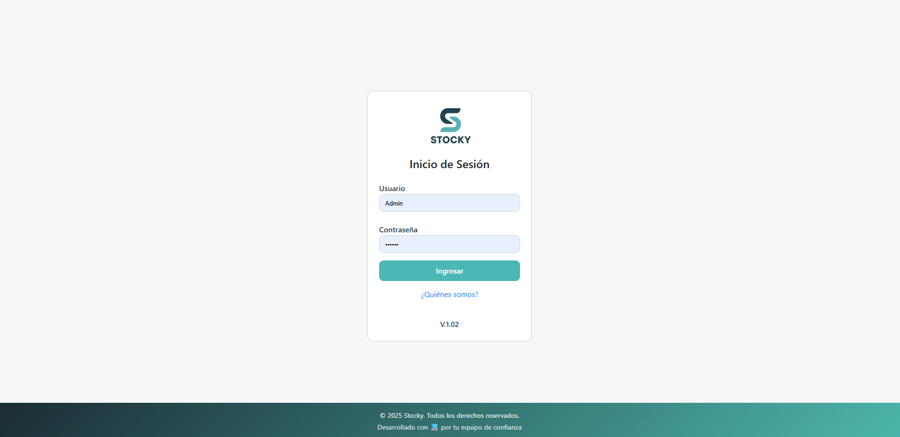
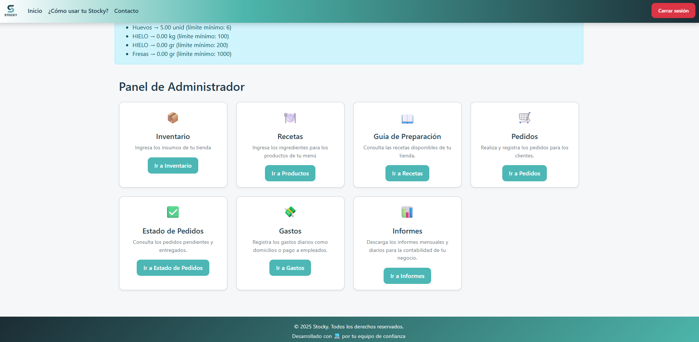
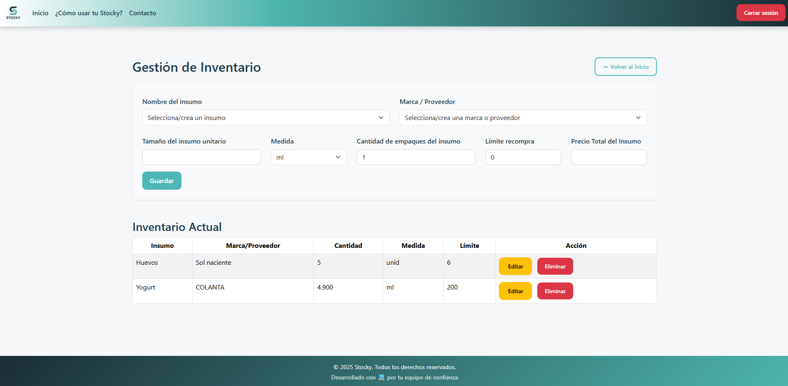
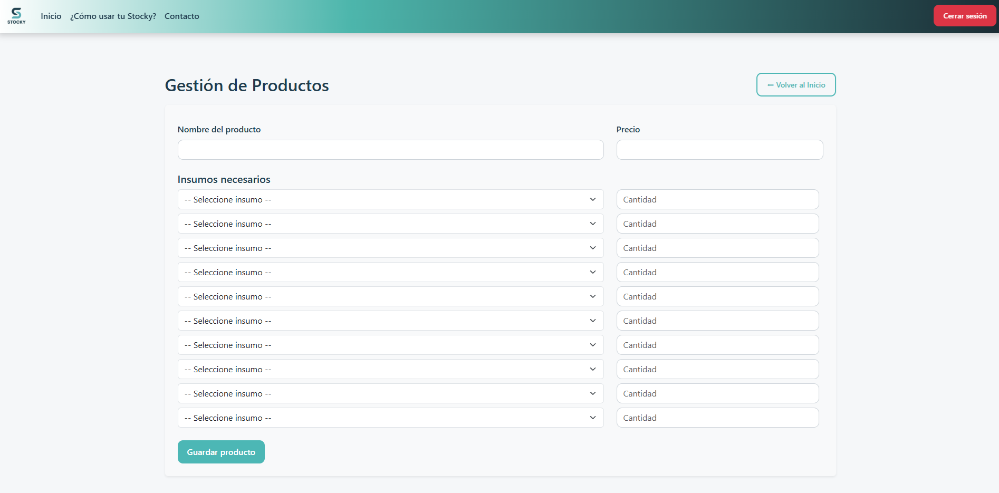

# Stocky - Inventory Management System

Stocky is a web application designed to help small businesses manage
their inventory, suppliers, and product costs.

## Features

- Product management
- Supplier management
- Inventory tracking
- Cost management
- Report generation

## Technologies

- PHP
- MySQL
- JavaScript
- HTML / CSS
- Git

## Screenshots

### Login

### Dashboard

### Inventory

### Products

## Author

Oscar Ronaldo Yañez
